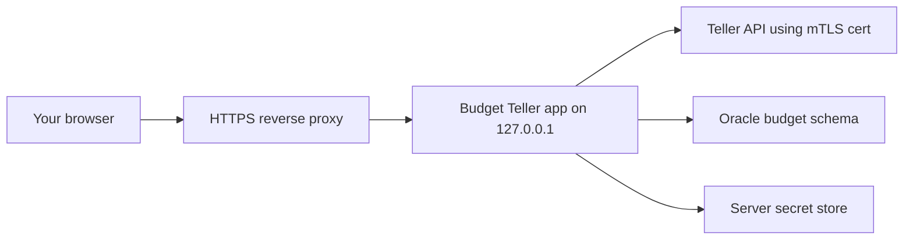

# Secure Server Setup

## Recommendation

Use your PC for short-lived development only. For real Amex/Teller data, use a small server with HTTPS, a dedicated service account, server-side secret storage, and a dedicated Oracle budget schema/user.

The server should own Teller API calls because Teller development and production data require mTLS client certificates. Do not place Teller private keys in browser/mobile code.

## What You Need To Get

### Teller Dashboard

Create or open your Teller application at the Teller Dashboard.

Collect these values:

- Application ID: goes into `TELLER_APPLICATION_ID`.
- Client certificate: store on the server at `TELLER_CERT_PATH`.
- Client private key: store on the server at `TELLER_CERT_KEY_PATH`.
- Token Signing Key: goes into `TELLER_SIGNING_PUBLIC_KEY`.
- Webhook signing secret: needed when we add webhook ingestion.

Teller notes:

- Use `development` first for real Amex testing.
- Development uses real financial data and requires mTLS.
- Development is free but capped at 100 enrollments.
- Production requires Teller KYB approval.

### American Express

You will enter your Amex credentials only inside Teller Connect. The app must never see or store your Amex username, password, or MFA secrets.

### Oracle

Preferred security posture:

- Create a dedicated Oracle user/schema for the budget app.
- Grant only the privileges needed for `BUDGET_` tables.
- Keep CashFlowArc tables and budget tables separated by schema, not only table prefix.
- Use Oracle wallet access from the server, not copied personal credentials in source code.

If we cannot create a separate Oracle user yet, the current fallback still keeps data separated with `BUDGET_` table names.

## Server Checklist

- Use a patched Linux or Windows server that only you administer.
- Put the app behind HTTPS using Caddy, nginx, IIS, or a managed reverse proxy.
- Bind the Python app to `127.0.0.1`; expose only the HTTPS proxy publicly.
- Store Teller cert/key with owner-only permissions.
- Store the app encryption master key in a secrets manager.
- Disable plaintext secrets in `.env` where possible.
- Never log request bodies, Teller tokens, Oracle passwords, wallet files, certs, or private keys.
- Verify Teller enrollment signatures using the dashboard Token Signing Key.
- Add webhook signature verification before accepting Teller webhooks.
- Use database backups and encrypted server volumes.
- Rotate Teller certificates and app encryption keys on a defined schedule.

## Minimal Server Secret Map

| Secret | Where It Comes From | Where It Should Live |
|---|---|---|
| `TELLER_APPLICATION_ID` | Teller Dashboard | Server env or secret store |
| `TELLER_CERT_PATH` | Teller certificate download | Protected server file path |
| `TELLER_CERT_KEY_PATH` | Teller certificate download | Protected server file path |
| `TELLER_SIGNING_PUBLIC_KEY` | Teller Dashboard | Server env or secret store |
| `DB_USER` / `DB_PASSWORD` | Oracle | Server secret store |
| `WALLET_DIR` | Oracle wallet | Protected server directory |
| `BUDGET_MASTER_KEY` | Generated by app/security admin | Secret manager only |

## Deployment Shape



## Immediate Next Step

Create/download the Teller app credentials, then place the cert/key either:

- Locally for a one-time development test, or
- On the server if you want to avoid real financial credentials touching your PC.

Once those values exist, run:

```powershell
python -m budget_teller_oracle doctor
python -m budget_teller_oracle serve
```

